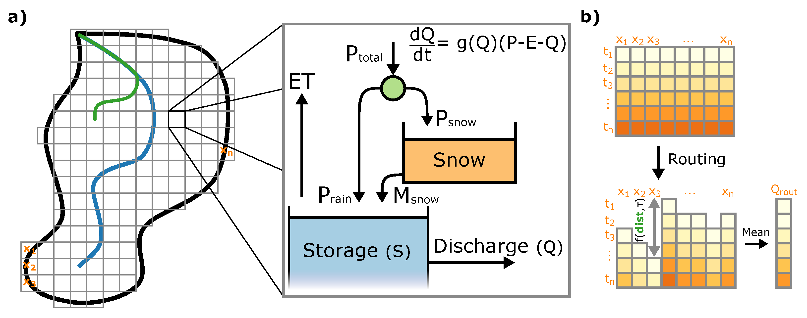

# Introduction

dS2 is a distributed hydrological model, based on the model defined by 
Kirchner (2009). The model assumes that the simulated discharge is solely 
dependent on the storage of that particular area. This model allows the user
to apply this concept in a distributed fashion, where the spatial resolution 
is determined by the input files. The temporal resolution can be modified by the
user as well.

# Requirements

- Python 3.6, including basic libraries, such as: datetime, glob, os, pickle
- NumPy (1.16.2)
- pandas (0.24.1)
- xarray (0.11.3)
- tqdm (4.31.1)

# Notes

All forcing input files should be entered as mm h-1, even if a coarser temporal
resolution is used. 

# Input

Both input and output directories can be relative to the current model path, or 
direct to another directory using the full path name.

Name              | Description                                                                     |  Unit  | Notes 
----------------- | ------------------------------------------------------------------------------- | ------ | ----- 
Precipitation     | Precipitation values per pixel per time step                                    | mm h-1 | - 
Evaporation       | Evaporation values per pixel per time step                                      | mm h-1 | - 
Temperature       | Temperature per pixel per time step                                             | mm h-1 | Only for snow 
Catchment         | Map indicating the location of each (sub)basin, indices corresponding to outlet, main outlet must be "1.0" | - | 2D ASCII file, where pixels outside the catchment are indicated with a NaN 
Distance          | Map with the distance of each pixel to the main outlet, via the stream network  | m | 2D ASCII files, pixels outside the catchment are indicated with a NaN 
routingInfo.pkl   | Pickle object with 3 dictionaries: outletLoc, catchLoc, outletInfo              | - | See below 

routingInfo.pkl:
* outletLoc: dict with outletID as keys, and the 1D cell number of the outlet location
* catchLoc: dict with outletID as keys, and the 1D cell numbers of all pixels within that subcatchment
* outletInfo: dict with outletID as keys, and a list as value with two items:
    * Downstream outletID
    * Distance to downstream outletID [m]

# Parameters and settings

Name              | Description                                            |  Example value | Unit  | Notes 
----------------- | ------------------------------------------------------ | ------ | ----------------- | --- 
alpha             | gQ parameter - intersect                               | -1.171 | -                 | - 
beta              | gQ parameter - slope                                   | 0.57   | -                 | -
gamma             | gQ parameter - curvature                               | -0.03  | -                 | If set to zero, gQ function is equal to original power-law a*Q^b 
eps               | ET - Reduction factor for ET                           | 0.89   | -                 | - 
tau               | Routing - Average velocity of water                    | 2      | m s-1  | Average velocity of water to travel from a point to the outlet via the river network 
Qt                | ET - Minimum discharge value for ET                    | 1e-4   | mm h-1 | If Qt+1 is expected to cross this threshold, ET is set to zero for these pixels 
T0                | Snow - Critical temperature for snowfall and melt      | 0      | deg C             | - 
ddf               | Snow - Degree day factor for snowmelt                  | 2.00   | mm day-1 degC-1   | Value is corrected for dt 
rdf               | Snow - Radiation day factor for snowmelt               | 0.26   | mm day-1 (W/m2)-1 | Value is corrected for dt 
dt                | Stability - Size of timestep in hours                  | 1      | h                 | If timestep coarser than 1 hour, specify here 
max_RAM           | Stability - Maximum RAM the model can use              | 1024   | MB                | Chunksize per file is determined by the model options 
size_one_value    | Stability - Size of a single value                     | 4      | bytes             | float32: 4 bytes, float64: 8 bytes 
LB                | Stability - Lower boundary for solver                  | 1e-3   | -                 | Factor determining the minimum value for Qt+1 (Qt * LB) 
max_gQ_difference | Stability - Maximum allowed difference in gQ values    | 2      | -                 | Difference is calculated based on abs(g(Q)_t2 - g(Q)_t1) / min(g(Q)_t2 - g(Q)_t1) 
dt_reduction      | Stability - Factor controlling the reduction in dt     | 0.15   | -                 | The new timestep is based on the order of magnitude difference between gQ, to the power of this value 
min_extra_dt      | Stability - Number of minimum extra dt per dt          | 5      | -                 | Parameter controls the minimum of internal timestep per dt
max_extra_dt      | Stability - Number of maximum extra dt per dt          | 50     | -                 | Parameter controls the maximum of internal timestep per dt  

# Explanation of scripts
- `dS2_model.py`: Main model code
- `dS2_settings_and_run.py`: File with model settings and example code to run the model
- `funcFluxes.py`: Functions for snowmelt and evaporation
- `funcParams.py`: Function to change parameters, with correction for units
- `funcRouting.py`: Functions required for routing
- `funcSolver.py`: Functions for both the RK4-approach with flexible dt, and the textbook Cash-Karp approach
- `readInput.py`: Functions to read settings class, and other file formats
- `readOutput.py`: Functions to write memmap files and translate memmap to NetCDF file

# References

Kirchner, J. W. (2009). Catchments as simple dynamical systems: Catchment 
characterization, rainfall‐runoff modeling, and doing hydrology backward. 
Water Resources Research, 45(2).
